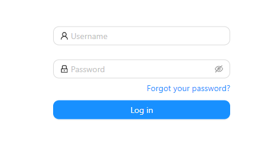

## Hello

Please see the [start page](index.md) for further details.


| First Header | Second Header | Third Header |
| ------------ | ------------- | ------------ |
| Content Cell | Content Cell  | Content Cell |
| Content Cell | Content Cell  | Content Cell |

```java
  @Column(
      name = "creation_date",
      columnDefinition = "TIMESTAMP WITHOUT TIME ZONE DEFAULT CURRENT_TIMESTAMP",
      nullable = false)
  private LocalDateTime creationDate = LocalDateTime.now();

  @Column(name = "version", columnDefinition = "text")
  private String version;
```

